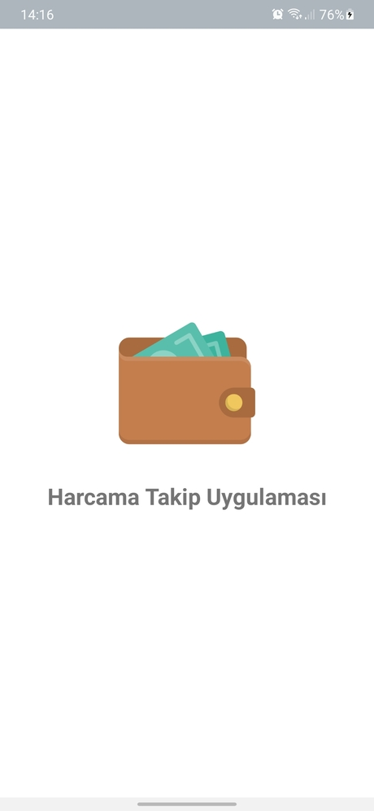
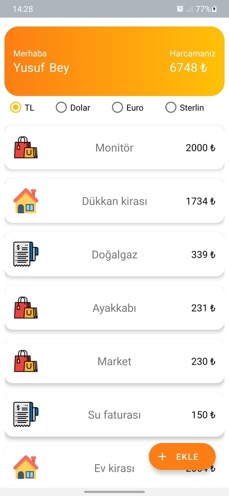

# GDG Turkey Android Bootcamp Bitirme Projesi
Kotlin dilinde MVVM mimarisi ile **Navigation, View Binding, Room DB, Retrofit ve RecyclerView** kullanılarak geliştirilmiştir. Tüm harcamalarınızı desteklenen 4 para biriminde kayıt altında tutarak, API aracılığı ile güncel olarak takip edebilirsiniz. İnternetinizin olmadığı durumlarda da en son güncel verileri kullanarak sizin için en iyi deneyimi sağlar.

## Splash Screen & Onboarding Screens
Uygulama açılışında bir splash screen ve uygulamanın ilk açılışında uygulamayı tanıtacak bir onboarding screen.

**İlk açılışta kullanıcıya hitap edebilmek bir adına isim talep edilir.**

## Para Birimleri
Toplam harcama ve her harcamanın tek tek fiyatını istenilen para biriminde (TL, Dolar, Euro ve Sterlin) görüntüleyebilirsiniz. Kurlar güncel olarak API üzerinden alınır.

## Ekleme ve Görüntüleme
İstenilen para biriminde ve tipte yeni harcama ekleme ekranı.

**Her harcamanın ayrı ayrı detayını görebileceğiniz bir detay sayfası. İstenildiği takdirde harcama silinebilir.**

Kişisel bilgilerin güncellenebileceğ profil ekranı.

#### Offline
İnternete bağlı olunmadığında ya da API ile ilgili herhangi bir hata ile karşılaşıldığında "İnternete bağlı değilsiniz" uyarısı ile kullanıcı uyarılır.

Güncel kur takibi için [ExchangeRate-API](https://www.exchangerate-api.com/) kullanılmıştır (ücretsiz sürüm, ayda 30000 istek).
